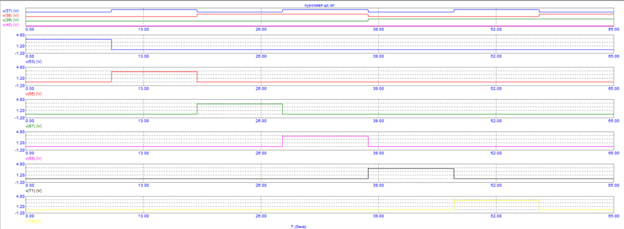
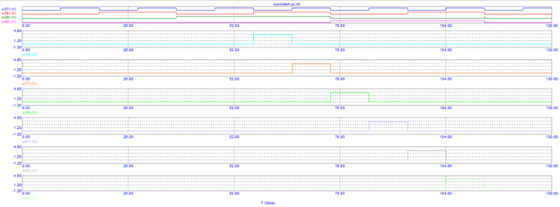
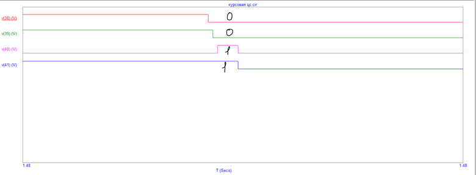
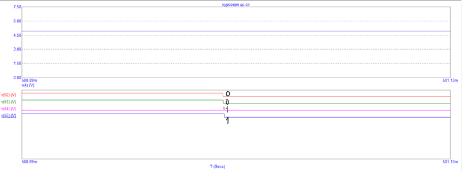

# LedClockProject

## Описание проекта
Курсовой проект по дисциплине «Цифровая схемотехника».

Разработана модель электронных часов со светодиодным циферблатом с минутным и часовым сегментами, шаг минутной стрелки 5 минут (диод горит 5 минут, затем гаснет, горит следующий) и возможностью управления через USB-интерфейс (построен прототип USB2.0).

---

## Выполненные задачи
- Разработка структурной схемы устройства  
- Реализация логики управления светодиодным циферблатом  
- Моделирование прототипа USB 2.0 в Microcap 12.2.0.5 
- Анализ временных характеристик сигналов  
- Отладка и проверка работы схемы  

---

## Временные диаграммы

### Управление светодиодами

### Сигналы сброса
  

---

### Полная схема устройства
- В файле представлена полная схема рабочего устройства.

## Отчет по проекту
[Скачать отчет (PDF)](LEDClock_report.pdf)

---

## Используемые инструменты
- Micro-Cap  
---

## Примечание
Проект выполнен в рамках учебной работы, но включает полный цикл разработки: от проектирования схемы до анализа сигналов и подбора реальных элементов.
